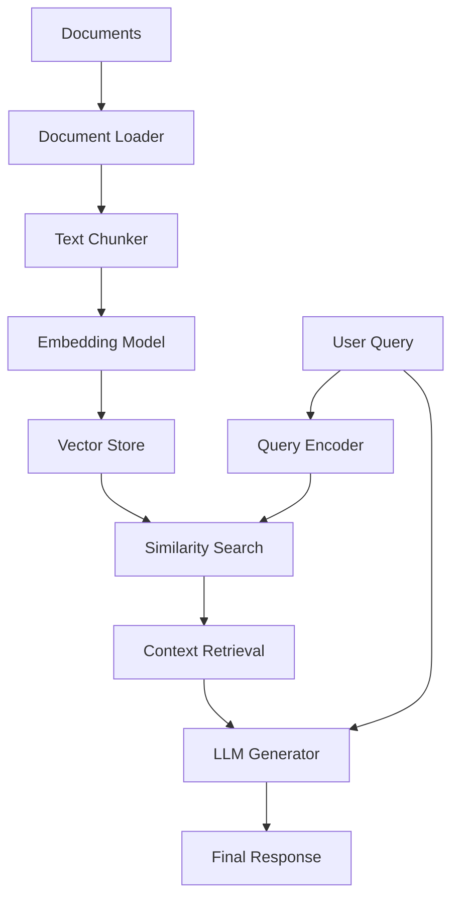

# 🔍 Custom RAG Pipeline – Retrieval-Augmented Generation from Scratch

[](https://colab.research.google.com/)
[](https://www.python.org/downloads/)
[](https://opensource.org/licenses/MIT)

## 🧠 Overview

This project demonstrates how to build a **complete Retrieval-Augmented Generation (RAG) pipeline from scratch**. The system processes various document types, creates intelligent retrieval mechanisms, and generates contextually accurate responses using Large Language Models (LLMs).

RAG enhances LLM capabilities by combining the power of information retrieval with text generation, enabling AI systems to answer questions based on your specific documents rather than relying solely on training data.

**Example Use Case**: The implementation includes a resume processing example, but the pipeline is designed to handle any document type - from technical manuals and research papers to company policies and knowledge bases.

---

## 📌 Key Features

* **Multi-Format Document Processing**: Handle PDFs, Word docs, Markdown, text files, and web content
* **Intelligent Text Chunking**: Split documents into semantically coherent, overlapping segments
* **Advanced Vector Embeddings**: Convert text into high-dimensional vectors using state-of-the-art models
* **Scalable Vector Storage**: Efficient indexing and similarity search using FAISS or cloud vector databases
* **Smart Retrieval System**: Find the most relevant document chunks for any user query
* **LLM Integration**: Generate accurate, contextual responses using retrieved content as grounding
* **Flexible Architecture**: Easily swap components (embeddings, vector stores, LLMs) for different use cases
* **Production-Ready**: Modular design suitable for both experimentation and deployment

---

## 🛠️ Tech Stack

| Component        | Options / Examples                                                                          |
| ---------------- | ------------------------------------------------------------------------------------------- |
| **Language**     | Python 3.8+                                                                                |
| **Embeddings**   | [sentence-transformers](https://github.com/UKPLab/sentence-transformers), OpenAI Embeddings |
| **Vector Store** | [FAISS](https://github.com/facebookresearch/faiss), Pinecone, Weaviate, Chroma            |
| **LLM Inference** | OpenAI (GPT-3.5/GPT-4), Anthropic Claude, Cohere, local models (Ollama, Hugging Face)    |
| **Document Parsing** | PyMuPDF, pdfplumber, python-docx, BeautifulSoup, markdown                             |
| **Orchestration** | Jupyter Notebook, FastAPI, Streamlit, or production scripts                               |

---

## 📁 Repository Structure

```
.
├── data/
│   ├── documents/                      # Place your source documents here
│   │   ├── sample_resume.pdf          # Example: Resume processing
│   │   ├── technical_manual.pdf       # Example: Technical documentation
│   │   └── company_policies.docx      # Example: Corporate documents
│   └── processed/                     # Processed chunks and metadata
├── src/
│   ├── ingestion.py                   # Document loading and parsing
│   ├── chunking.py                    # Text chunking strategies
│   ├── embedding.py                   # Vector embedding generation
│   ├── vector_store.py                # Vector database operations
│   ├── retrieval.py                   # Query processing and retrieval
│   ├── generation.py                  # LLM response generation
│   └── rag_pipeline.py                # End-to-end RAG orchestration
├── notebooks/
│   ├── 01_document_processing.ipynb   # Document ingestion walkthrough
│   ├── 02_embedding_exploration.ipynb # Embedding model comparison
│   └── 03_complete_rag_demo.ipynb     # Full pipeline demonstration
├── config/
│   ├── embedding_config.yaml          # Embedding model configurations
│   ├── llm_config.yaml               # LLM provider settings
│   └── chunking_config.yaml          # Text chunking parameters
├── requirements.txt                   # Python dependencies
├── .env.example                      # Environment variables template
└── README.md                         # This documentation
```

---

## 🚀 Getting Started

### Prerequisites

- Python 3.8 or higher
- API keys for your chosen LLM provider (OpenAI, Anthropic, etc.)

### Quick Installation

1. **Clone the repository**
   ```bash
   git clone https://github.com/yourusername/custom-rag-pipeline.git
   cd custom-rag-pipeline
   ```

2. **Set up environment**
   ```bash
   python -m venv rag_env
   source rag_env/bin/activate  # On Windows: rag_env\Scripts\activate
   pip install -r requirements.txt
   ```

3. **Configure environment variables**
   ```bash
   cp .env.example .env
   # Edit .env with your API keys and preferences
   ```

4. **Add your documents**
   ```bash
   # Place your files in data/documents/
   cp your_documents.pdf data/documents/
   ```

5. **Run the pipeline**
   ```bash
   python src/rag_pipeline.py --build-index --query "Your question here"
   ```

---

## 📊 How the RAG Pipeline Works

### Core Architecture



### Step-by-Step Process

1. **📄 Document Ingestion**
   ```python
   # Load various document formats
   documents = DocumentLoader.load_directory("data/documents/")
   ```

2. **✂️ Text Chunking**
   ```python
   # Split into semantic chunks with overlap
   chunks = TextChunker.chunk_documents(
       documents, 
       chunk_size=500, 
       overlap=50
   )
   ```

3. **🧮 Vector Embedding**
   ```python
   # Convert chunks to embeddings
   embeddings = EmbeddingModel.encode(chunks)
   ```

4. **🗃️ Vector Storage**
   ```python
   # Store in vector database
   vector_store.add_embeddings(chunks, embeddings)
   ```

5. **🔍 Query Processing**
   ```python
   # Retrieve relevant chunks
   relevant_chunks = vector_store.similarity_search(query, k=5)
   ```

6. **🤖 Response Generation**
   ```python
   # Generate contextual response
   response = llm.generate(query, context=relevant_chunks)
   ```

---

## 🤖 Usage Examples

### Basic Python API

```python
from src.rag_pipeline import RAGPipeline

# Initialize pipeline
rag = RAGPipeline(
    embedding_model="all-MiniLM-L6-v2",
    llm_provider="openai",
    llm_model="gpt-3.5-turbo"
)

# Process documents
rag.ingest_directory("data/documents/")

# Query the system
response = rag.query("What are the key topics covered in the documents?")
print(response.answer)
print(f"Sources: {response.sources}")
```

### Advanced Configuration

```python
# Custom chunking strategy
rag = RAGPipeline(
    chunking_strategy="semantic",
    chunk_size=750,
    overlap_percentage=0.1,
    embedding_model="text-embedding-ada-002",
    vector_store="pinecone",
    llm_provider="anthropic",
    llm_model="claude-3-sonnet"
)

# Batch processing
results = rag.batch_query([
    "Summarize the main findings",
    "What are the recommendations?",
    "List all mentioned statistics"
])
```

### Command Line Interface

```bash
# Build index from documents
python src/rag_pipeline.py --build-index --input-dir data/documents/

# Interactive query mode
python src/rag_pipeline.py --interactive

# Single query
python src/rag_pipeline.py --query "Your question" --top-k 3
```

---

## 🔧 Customization Options

### Document Types Supported

| Format | Library Used | Notes |
|--------|-------------|-------|
| **PDF** | PyMuPDF, pdfplumber | Handles text, tables, and metadata |
| **Word** | python-docx | .docx files with formatting |
| **Markdown** | markdown | Technical documentation |
| **HTML** | BeautifulSoup | Web pages and articles |
| **Text** | Built-in | Plain text files |
| **CSV** | pandas | Structured data processing |

### Embedding Models

```python
# Fast and efficient (default)
embedding_model = "all-MiniLM-L6-v2"

# Higher quality
embedding_model = "all-mpnet-base-v2"

# OpenAI embeddings
embedding_model = "text-embedding-ada-002"

# Domain-specific models
embedding_model = "sentence-transformers/allenai-specter"  # Scientific papers
```

### Vector Stores

```python
# Local FAISS (development)
vector_store = FAISSVectorStore()

# Pinecone (production)
vector_store = PineconeVectorStore(api_key="your-key")

# Weaviate (self-hosted)
vector_store = WeaviateVectorStore(url="http://localhost:8080")
```

### LLM Providers

```python
# OpenAI
llm = OpenAILLM(model="gpt-4", temperature=0.1)

# Anthropic
llm = AnthropicLLM(model="claude-3-sonnet")

# Local models
llm = OllamaLLM(model="llama2:7b")
```

---

## 📈 Performance Optimization

### Chunking Strategies

- **Fixed-size**: Equal chunks with overlap (fast, simple)
- **Sentence-based**: Preserve sentence boundaries (better context)
- **Semantic**: Split by topics or sections (highest quality)
- **Recursive**: Hierarchical splitting (balanced approach)

### Retrieval Tuning

```python
# Adjust retrieval parameters
retrieval_config = {
    "top_k": 5,                    # Number of chunks to retrieve
    "score_threshold": 0.7,        # Minimum similarity score
    "rerank": True,                # Post-retrieval reranking
    "diversity_penalty": 0.1       # Promote diverse results
}
```

### Generation Optimization

```python
# Fine-tune generation parameters
generation_config = {
    "temperature": 0.1,            # Lower = more focused
    "max_tokens": 500,             # Response length limit
    "system_prompt": custom_prompt, # Domain-specific instructions
    "citation_style": "detailed"    # Include source references
}
```

---

## 🌟 Real-World Applications

### Enterprise Use Cases

- **Knowledge Management**: Internal documentation Q&A
- **Customer Support**: Automated help desk responses
- **Research & Analysis**: Scientific literature review
- **Legal & Compliance**: Policy and regulation queries
- **Training & Onboarding**: Interactive learning systems

### Implementation Examples

```python
# Customer support bot
support_rag = RAGPipeline(
    documents="support_docs/",
    system_prompt="You are a helpful customer support agent..."
)

# Research assistant
research_rag = RAGPipeline(
    documents="research_papers/",
    embedding_model="allenai-specter",
    citation_style="academic"
)

# Internal knowledge base
company_rag = RAGPipeline(
    documents="company_docs/",
    access_control=True,
    user_permissions=user_roles
)
```

---

## 📚 References and Resources

### Key Papers
- **Lewis et al.** - [Retrieval-Augmented Generation for Knowledge-Intensive NLP Tasks](https://arxiv.org/abs/2005.11401) (2020)
- **Karpukhin et al.** - [Dense Passage Retrieval](https://arxiv.org/abs/2004.04906) (2020)
- **Izacard & Grave** - [Leveraging Passage Retrieval with Generative Models](https://arxiv.org/abs/2007.01282) (2020)

### Frameworks and Tools
- **[LangChain](https://langchain.com/)** - High-level RAG framework
- **[LlamaIndex](https://www.llamaindex.ai/)** - Data framework for LLMs
- **[Haystack](https://haystack.deepset.ai/)** - End-to-end NLP framework
- **[Chroma](https://www.trychroma.com/)** - Vector database for AI applications

### Learning Resources
- **[RAG Course by DeepLearning.AI](https://www.deeplearning.ai/courses/)** - Comprehensive RAG training
- **[Pinecone Learning Center](https://www.pinecone.io/learn/)** - Vector database tutorials
- **[Hugging Face NLP Course](https://huggingface.co/course/)** - Transformers and embeddings

---

## 🤝 Contributing

We welcome contributions! Here's how you can help:

### Development Setup

```bash
# Clone and setup development environment
git clone https://github.com/yourusername/custom-rag-pipeline.git
cd custom-rag-pipeline
pip install -r requirements-dev.txt
pre-commit install
```

### Areas for Contribution

- **New Document Parsers**: Support additional file formats
- **Embedding Models**: Integration with new embedding providers
- **Vector Stores**: Additional vector database connectors
- **Evaluation Metrics**: RAG performance benchmarking
- **UI Components**: Web interface and visualization tools

### Contribution Process

1. Fork the repository
2. Create a feature branch (`git checkout -b feature/amazing-feature`)
3. Make your changes with tests
4. Commit your changes (`git commit -m 'Add amazing feature'`)
5. Push to your branch (`git push origin feature/amazing-feature`)
6. Open a Pull Request

---

## 📄 License

This project is licensed under the MIT License - see the [LICENSE](LICENSE) file for details.

---

## 🔮 Roadmap

### Upcoming Features

- [ ] **Multi-modal RAG**: Support for images and tables
- [ ] **Streaming Responses**: Real-time answer generation
- [ ] **Advanced Reranking**: Cross-encoder reranking models
- [ ] **Graph RAG**: Knowledge graph integration
- [ ] **Evaluation Suite**: Automated RAG performance testing
- [ ] **Web Interface**: User-friendly web application
- [ ] **API Server**: RESTful API for production deployment

### Long-term Vision

Building towards a comprehensive, production-ready RAG framework that can handle enterprise-scale document processing with advanced features like multi-tenancy, real-time updates, and sophisticated retrieval strategies.

---

**Built with ❤️ for the AI community**

*Transform your documents into intelligent, queryable knowledge bases.*
